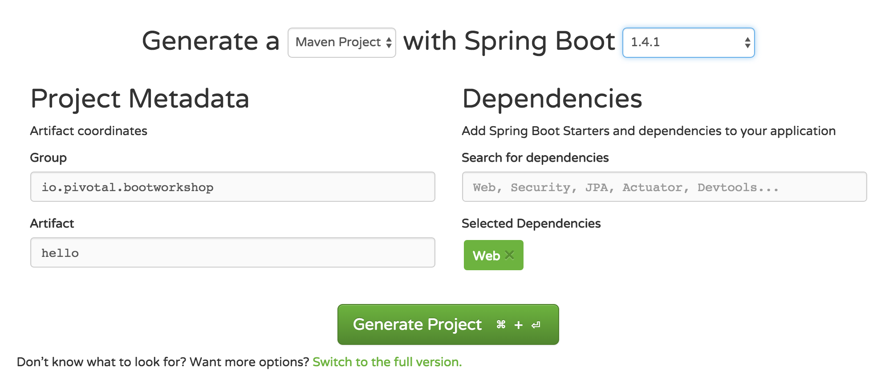

= Lab 1: Spring Boot Basics

== part 1: run locally
. visit link:http://start.spring.io[start.spring.io]
+

. configure your project
.. group name
.. artifact name (*_'hello'_* is recommended)
.. *_maven_* for your build system
.. spring boot version 1.4.1
. add dependencies
.. Web
. 'Generate Project'
. unzip the downloaded file
. open in IDE or cd to project directory for vim/emacs
. open pom.xml - notice the spring starters
. create class: `HelloController` in same directory as the Boot app class
.. annotate the class with `@RestController` (package: `org.springframework.web.bind.annotation`)
.. create method: `public String sayHello() { return "Hello World"; }`
.. annotate the method with: `@RequestMapping("/")` (package: `org.springframework.web.bind.annotation`)
.. Your source should look something like this:
+
....
 package bootworkshop.pivotal.io;

 import org.springframework.web.bind.annotation.RequestMapping;
 import org.springframework.web.bind.annotation.RestController;

 /**
  * Created by rhardt on 9/21/16.
  */
 @RestController
 public class HelloController {

     @RequestMapping("/")
     public String sayHello(){
         return "Hello DISH!";
     }

 }

....

. from project root directory, run `mvn spring-boot:run`
. point a web browser to http://localhost:8080
. bask in the glory that is Spring Boot

== part 2: push to Pivotal Cloud Foundry
. make sure you have all of your link:/Spring-Workshop-Dish/pre-requisites/Spring_Boot_Labs_Setup.html[prerequisites] in place.
. build a runnable jar `./mvnw package`
. log in to cloud foundry `cf login -a api.yourpcfsystem.com`
. when prompted, provide your email and password
. if prompted, choose an appropriate org and space
. push your app:  `cf push hello -p ./target/hello-0.0.1-SNAPSHOT.jar -n "hello-rob" -b java_buildpack`
.. instead of 'hello-rob' give your app a unique route (the `-n` option)
.. depending on what you called your app, the runnable jar (the `-p` option) may be different
.. watch the output, it will tell you the url of your app
+
....
Creating app hello in org Vertical / space rhardt-sandbox as rhardt@pivotal.io...
OK

Creating route hello-rob.cfapps.io...
OK

Binding hello-rob.cfapps.io to hello...
OK
....
. open a web browser to the route of your app - from the output of the `cf push`
. celebrate
. silently complain about the so-un-2016-uber-long command you must issue to push to Cloud Foundry
. stop complaining and put it in a manifest.yml at the top level of your project
+
....
---
applications:
- name: hello
  buildpack: java_buildpack
  host: hello-${random-word}
  path: target/hello-0.0.1-SNAPSHOT.jar
....
. `cf push`
. `cf apps` will show you all the deployed apps in your space along with their vital stats and mapped routes.  Notice the random words from the manifest file.
+
....
Robs-MacBook-Pro-3:hello rhardt$ cf apps
Getting apps in org Vertical / space rhardt-sandbox as rhardt@pivotal.io...
OK

name                  requested state   instances   memory   disk   urls
ep-shell              started           1/1         128M     1G     ep-shell.cfapps.io
hello                 started           1/1         1G       1G     hello-rob.cfapps.io, hello-unscaled-multimillion.cfapps.io
vto-server-loadtest   stopped           0/1         4G       1G     vto-server-rob.cfapps.io
....
. verify your app at its new randomly-generated route

= Part 3: Extra Credit

.  Why `@RestController`?
. Allows you to return strings, but also enables some interesting features
. Add this class to your HelloController.java file:
+
....
class Greeting {
    private String message;
    private String greeting;
    private boolean happyToSeeYou;

    //constructor, getters, setters omitted for brevity

}
....
.  and add this method:
+
....
    @RequestMapping("/greeting")
    public Greeting greet() {
        return new Greeting("Hello", "DISH", true);
    }
....
. now `cf push` and visit http://hello-random-words.yourhost.com/greeting
. marvel at your newfound speed and productivity

